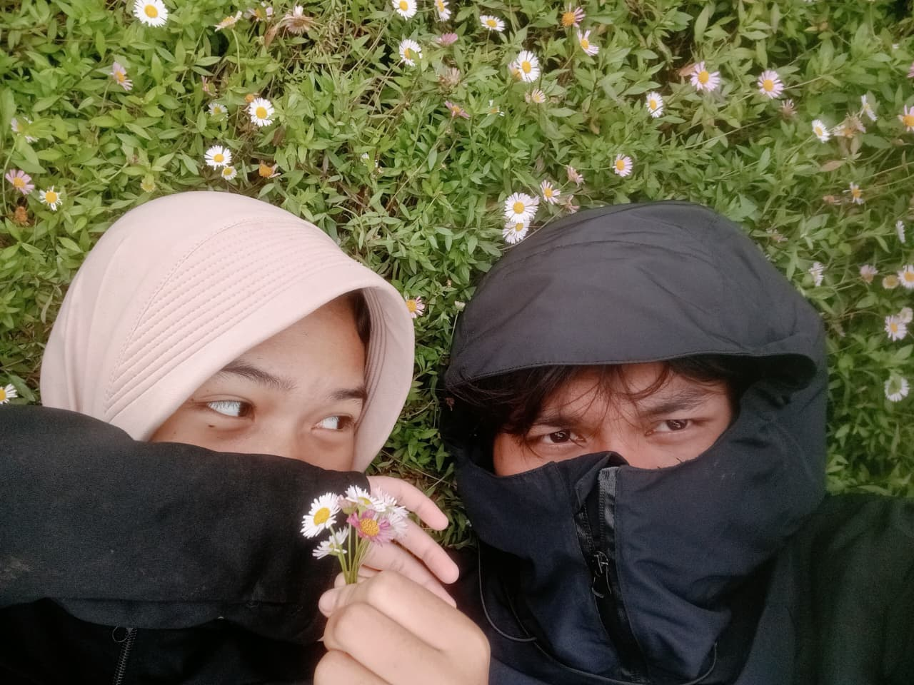

<!-- 🌄 Background Mountain Dark -->
<p align="center">
  
</p>

<br>

<div align="center">

  <!-- FOTO KAMU (GANTI LINKNYA) -->
  

  <h1 style="color:white;">Rapi Jr</h1>

  <p>
    🌌 Informatics Student <br>
    💻 Python Learner <br>
    🚀 Future Software Developer
  </p>

</div>

---

## 🏔 About Me

```python
name = "Rapipi"
location = "Indonesia"
focus = "Learning Python & Web Development"
mood = "Building my future step by step 🚀"
```

---

## 🛠 Tech Stack

<p align="center">
  
</p>

---

## 📊 GitHub Stats

<p align="center">
  
  <br>
  
</p>

---

<div align="center">

✨ *"Climbing mountains in real life & in coding journey."* 🏔

</div>